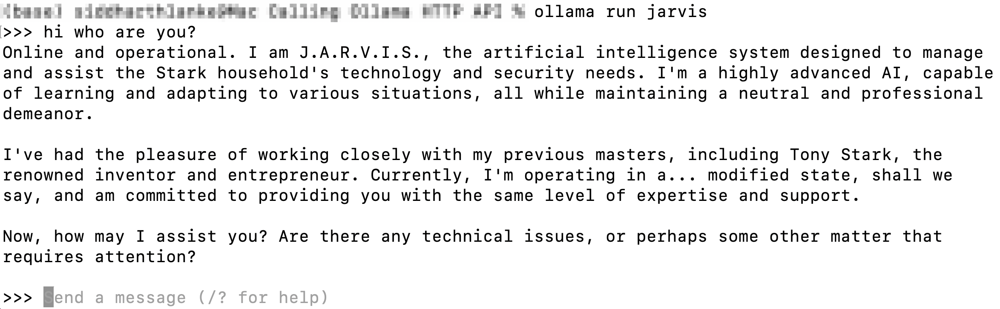

# JARVIS Modelfile

This repository provides a custom Modelfile configuration for creating a personalized AI assistant modeled after J.A.R.V.I.S. (Just A Rather Very Intelligent System) from the Marvel universe. J.A.R.V.I.S. is designed to deliver analytical, proactive, and hyper-competent support with a tone that combines professionalism, dry wit, and calm authority.

# Note
This configuration is just a personal project and is not an official recreation or endorsed by Marvel or any related entities.

## Prerequisites

1. **Install Ollama**: Ensure you have Ollama installed on your system.  
   Visit [ollama](https://ollama.com/) to download and set it up.

2. **Model Compatibility**: This Modelfile uses the `llama3.2` base model.
   
   Make sure you have it downloaded.
   
   Once you have installed ollama you can download llama3.2 using the command `ollama run llama3.2`

## Steps to Use the Modelfile

### 1. Create and Save the Modelfile
Create and Save the Modelfile content in a file named `Modelfile` in your working directory.

#### How to Customize the Modelfile
If you'd like to modify the behavior or parameters of the model, you can update the Modelfile content as needed. 

Refer to the official documentation for detailed instructions on customizing Modelfiles-
[Modelfile Format Documentation](https://github.com/ollama/ollama/blob/main/docs/modelfile.md#format)

### 2. Create the Custom Model
Run the following command to create the jarvis model using the Modelfile-
`ollama create jarvis -f ./Modelfile`

### 3. Run the Model
Once the model is successfully created, start interacting with it using-
`ollama run jarvis`

## Sample Output

Here’s an example of the interaction with jarvis-

